# Diamond on Tenstorrent

Diffusion world model ([DIAMOND](https://diamond-wm.github.io), NeurIPS 2024) running on Tenstorrent Blackhole hardware. Generates Atari Breakout frames autoregressively using pretrained weights from HuggingFace.

## Architecture

UNet-based diffusion denoiser. 4-level encoder/decoder, channels [64,64,64,64], depth 2 per level, no attention except mid blocks. 3 denoising steps per frame using Euler sampling. Conditioning: 4 prior RGB frames (64x64) + 4 actions, projected via Fourier noise embedding + action embedding + MLP.

## Performance

| Mode | Per-frame | FPS | Notes |
|------|-----------|-----|-------|
| No caching | ~67ms | ~14 | Current default. Fresh GN output buffer each call. |
| With GN output caching + tracing | ~57ms (3x ~19ms) | ~17 | Produces noisy output due to GN buffer reuse bug. Under investigation. |

## Kernels

| Operation | Backend | Notes |
|-----------|---------|-------|
| GroupNorm | TT-Lang | 3-pass kernel (mean, variance, normalize). Replaces ttnn.group_norm which crashes at small spatial sizes. |
| SiLU, Add, Mul, AdaLN modulate, Precondition, Euler step | TT-Lang | Fused elementwise kernels with grid="auto" streaming. Not yet wired into the main inference path. |
| Conv2d, SiLU, Add, Mul, Upsample, Concat, Clip | TTNN | Standard ops. |
| Conditioning (Fourier features, embeddings, MLP) | PyTorch CPU | Small, runs once per denoise step. |
| AdaLN modulate, Precondition, Euler step | TTNN | On-device scalar ops. |

## How to run

Requires a Tenstorrent device accessible via the [tt-connect-remote-device](https://docs.tenstorrent.com) scripts.

### Batch mode (generate 8 frames)

```bash
scripts/run-test.sh --hw tt/diamond_play.py
```

### Interactive mode (browser UI)

Run on the remote in two terminals:

```bash
# Terminal 1: model generator
python3 /tmp/play.py

# Terminal 2: HTTP server
python3 /tmp/play_server.py
```

Forward port 8000 to your local machine and open http://localhost:8000. The browser UI provides a game dropdown (26 Atari games), keyboard controls (WASD + Space), and live frame display.


Initial frame data must be present at `/tmp/diamond_data/{Game}/initial_frames.pt` and `initial_actions.pt` on the remote. Generate locally with `scripts/generate_initial_frames.py`, then copy with the provided tarball workflow.

Weights are downloaded automatically from `eloialonso/diamond` on HuggingFace.

## Files

| File | Description |
|------|-------------|
| `tt/diamond_play.py` | Batch inference: creates Breakout frames, runs diffusion loop, saves PNGs |
| `tt/play.py` | Interactive generator: reads actions, writes frames via file IPC |
| `tt/play_server.py` | HTTP server with embedded browser UI for interactive play |
| `tt/kernels.py` | TT-Lang fused kernels (GroupNorm) |
| `tt/test_pcc_triage.py` | Layer-by-layer PCC comparison vs PyTorch reference |

## Output

4 synthetic conditioning frames followed by 8 model-generated frames:

| Input frames (conditioning) | | | |
|---|---|---|---|
| 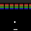 | 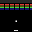 | 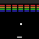 | 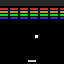 |

| Generated frames | | | |
|---|---|---|---|
| 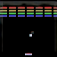 | 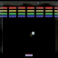 | 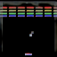 | 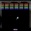 |
| 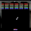 | 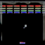 | 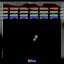 | 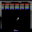 |
